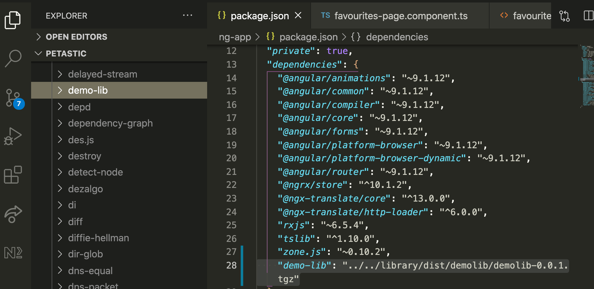

# How to create and publish a library in Angular

Reference: [Demo of local library creation and installation](https://www.youtube.com/watch?v=U--hmDBGfa8).

1. Create workspace and library name \
   `ng new workspaceName --create-application=false` \
   cd workspaceName \
   `ng generate library libraryName`

2. Make edits for library / what you want exported (the bulk of the work). This step is _not_ part of the config.

3. `ng build libraryName`

4. cd into dist/libraryName. Run `npm pack`

5. Inside dist/libraryName, there will be a .tgz file. This can be installed locally as a library from a separate client application by creating the path to it within the package.json of the client application. i.e. See step 8 image. "demo-lib": "../../library/dist/demolib/demolib-0.0.1.tgz"

6. In client application, run `npm install`

## Local Installation

8. In client application, check that the library downloaded in node_modules to confirm it downloaded. If completed, you can move to step 13 if you do not want to publish onto npm.

## Publish and Install

9. run `ng build --prod` to ensure library builds in ViewEngine.

Reference: https://github.com/angular/angular/issues/37973.

10. cd into dist/libraryName

11. Run `npm publish`. You may need to alter the version in your package.json if you have the same version already published and repeat steps 9 and 10.
    **NOTE**: If your npm account isn't connected already, run `npm adduser` and follow the prompts.

12. Install your package from npm onto your client application.

13. In client application, import what is needed from the library (i.e. 10:10 of YT video) in component.ts file and use it within the HTML file.
